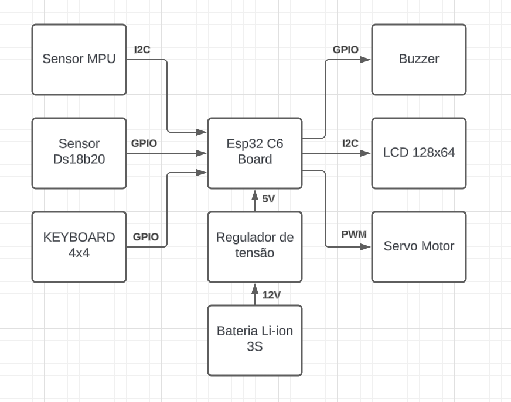
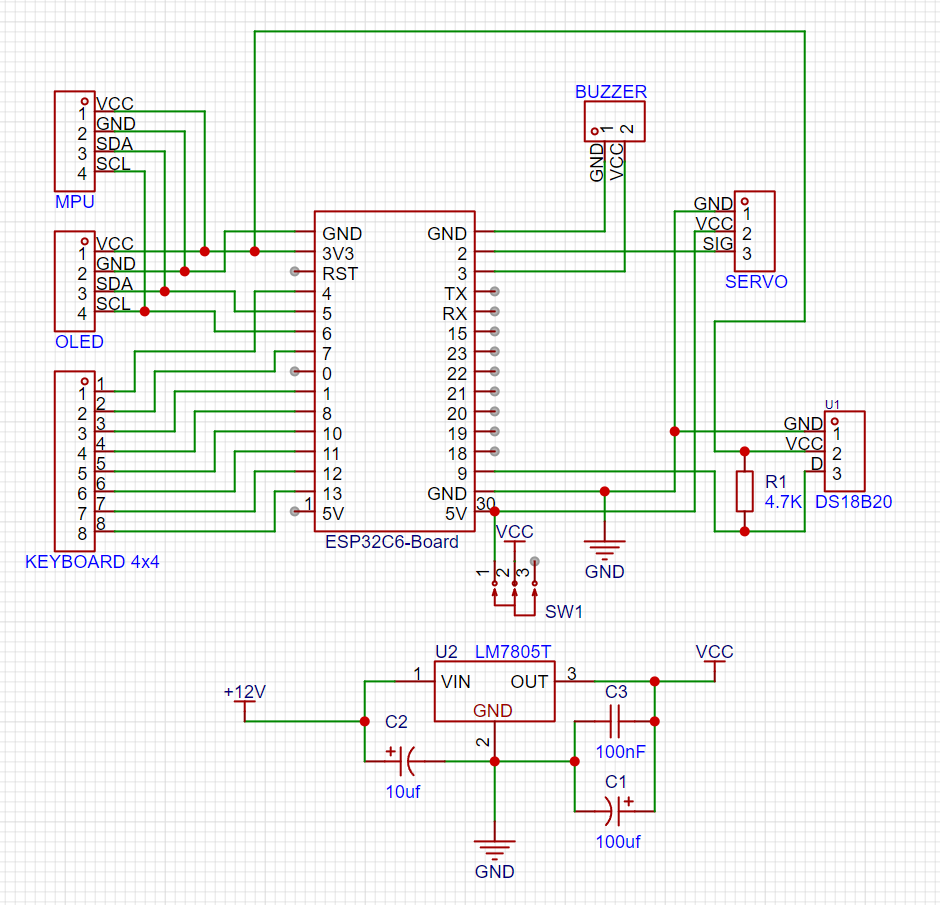

# Projeto final da disciplina de Embarcados IFPB-CG

- Ismael Marinho
- Ana Lívia 
- Lucas Daris
- Arthur Siqueira

# Projeto de Cofre Inteligente com Sensor de Temperatura e Detecção de Movimento

Este projeto implementa um cofre inteligente que utiliza sensores de temperatura e movimento para ativar um alarme, além de um sistema de autenticação por senha. O cofre é controlado por um microcontrolador ESP32 e integra diversos componentes para garantir segurança e monitoramento.

### Módulos Utilizados

- Microcontrolador ESP32
- [MPU 6050](./components/mpu/mpu_component_doc.md)
- [Display Oled SSD1306](./components/oled_display/oled_component_doc.md)
- [DS18B20](./components/ds18b20/ds18b20_component_doc.md)
- [PWM](./components/pwm/ssr_component_doc.md)
- Teclado matricial 4x4
- Servo motor
- Buzzer ativo
- Resistores e jumpers

  
*Diagrama de blocos do sistema.*

  
*Esquemático elétrico do projeto.*

## Funcionalidades Principais
- **Sensor de Temperatura DS18B20**: Dispara um alarme se a temperatura ultrapassar 40°C.
- **Sensor MPU6050 (Acelerômetro/Giroscópio)**: Detecta movimento e ativa o alarme se o cofre for sacudido ou movido.
- **Teclado Matricial 4x4**: Para inserção de senha e navegação no menu.
- **Display OLED**: Exibe status do cofre, entrada de senha e menus.
- **Servo Motor**: Controla a abertura/fechamento da porta do cofre.
- **Buzzer**: Emite alertas sonoros em caso de intrusão ou condições anormais.
- **Armazenamento de Senha**: A senha é salva em memória não volátil (NVS).

## Explicação do Código

### Estrutura Geral
O código utiliza as seguintes bibliotecas e configurações:
- **Sensores**: `ds18b20.h` (temperatura), `mpu.h` (movimento)
- **Interface**: `oled_display.h` (display), teclado matricial
- **Controle**: `pwm.h` (servo motor), `ledc.h` (PWM)
- **Armazenamento**: `nvs_flash.h` (senha em memória persistente)

### Funções Principais
1. **Inicialização (`init_modules`)**:
   - Configura I2C, PWM, sensores, display e GPIOs.
   - Calibra o MPU6050 para definir a posição inicial de repouso.

2. **Verificação de Integridade (`check_integrity`)**:
   - Monitora temperatura e aceleração nos eixos X/Y/Z.
   - Retorna `-1` se houver movimento brusco ou temperatura alta.

3. **Gerenciamento de Senha**:
   - `write_password`: Salva a senha no NVS.
   - `read_password`: Lê a senha armazenada.

4. **Controle do Cofre**:
   - `open_safe_door`/`close_safe_door`: Controla o servo motor para abrir/fechar.
   - `beep`: Ativa o buzzer em caso de alarme.

5. **Interface do Usuário**:
   - Funções `show_*_display`: Controlam o conteúdo exibido no OLED.
   - `read_keyboard`: Lê entradas do teclado matricial.

### Lógica de Operação
- O loop principal (`app_main`) gerencia:
  - Entrada de senha com timeout.
  - Menu para alterar senha ou sair.
  - Verificação contínua de segurança (temperatura/movimento).
  - Bloqueio após 3 tentativas falhas.

## Instalação e Uso
1. **Dependências**:
   - ESP-IDF (versão 4.4+)
   - Bibliotecas: `ds18b20`, `mpu6050`, `oled_display`

2. **Montagem**:
   - Conecte os componentes conforme o esquemático.
   - Ajuste os pinos no código se necessário.

## Personalização
- Ajuste os limiares de temperatura e sensibilidade do acelerômetro em `check_integrity`.
- Modifique os pinos no cabeçalho do código conforme sua montagem.

## Licença
Distribuído sob licença MIT. Veja `LICENSE` para detalhes.
